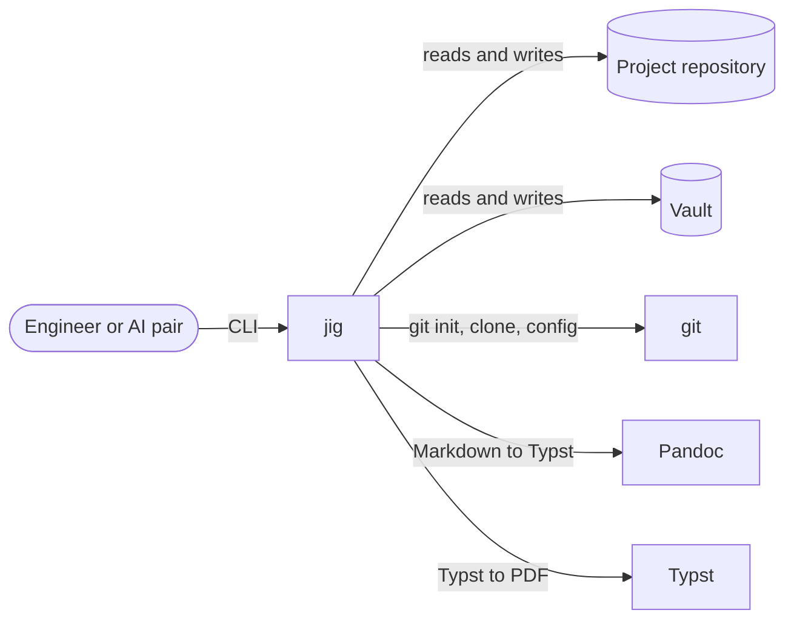
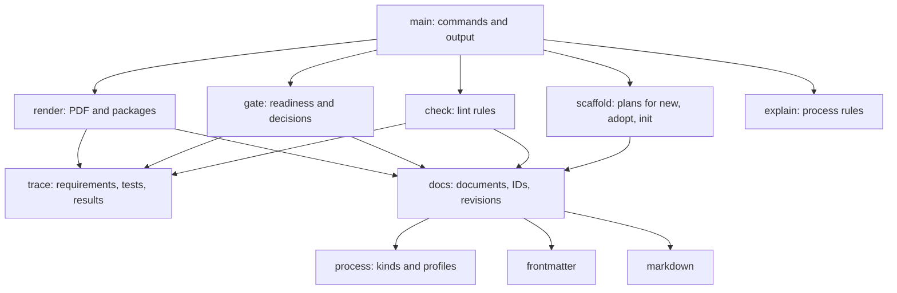
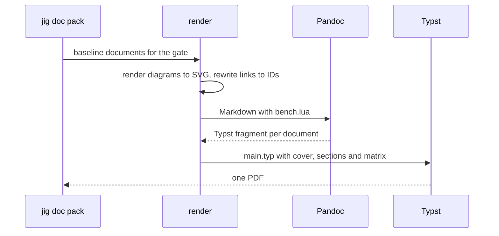
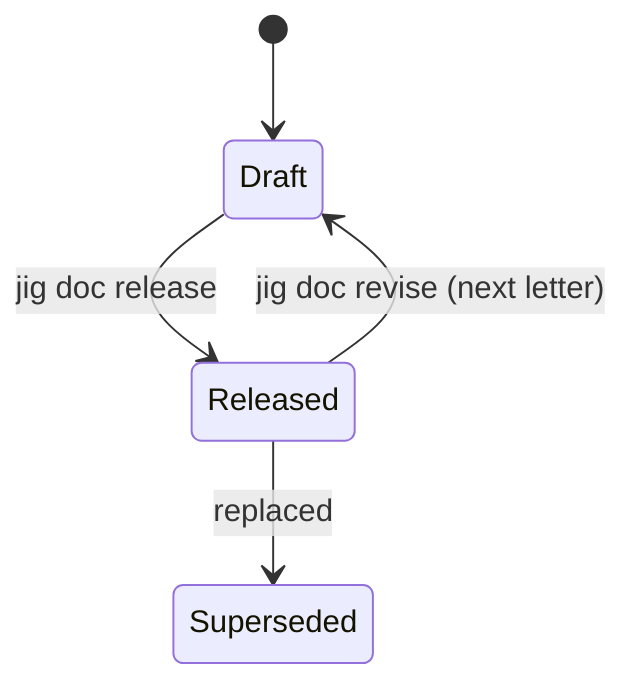

# Architecture description

## 1. Purpose and scope

This document describes the architecture of JIG: its context, building blocks, runtime behaviour and performance budgets, and how they meet the [system requirements](requirements.md).

## 2. Architecture drivers

| Driver | Requirements | Consequence |
|---|---|---|
| One source of truth for the process | REQ-013, REQ-014 | The lifecycle and document catalog are data, embedded in the binary ([JIG-ADR-001](decisions/ADR-001-encode-the-process-as-data-embedded-in-the-binary.md)) |
| Industrial-looking PDFs from Markdown | REQ-016, REQ-017 | Pandoc converts Markdown to Typst and Typst lays out pages ([JIG-ADR-002](decisions/ADR-002-render-pdfs-with-pandoc-and-typst.md)) |
| Diagrams without a browser | REQ-018 | Mermaid and WaveDrom render in process ([JIG-ADR-003](decisions/ADR-003-render-diagrams-in-process-with-rust-renderers.md)) |
| Leak-proof separation | REQ-006, REQ-007, REQ-035, REQ-036, REQ-038 | Private terms come from the vault, never from the tool ([JIG-ADR-005](decisions/ADR-005-keep-private-terms-in-the-vault.md)); git names the files to check ([JIG-ADR-009](decisions/ADR-009-check-the-files-git-would-commit.md)); agent files stay out of the repository ([JIG-ADR-007](decisions/ADR-007-keep-agent-instructions-in-the-vault-and-install.md)) |
| Verification that stays true | REQ-043, REQ-044 | Each test result carries a stamp of what it verified ([JIG-ADR-008](decisions/ADR-008-stamp-each-test-result-with-what-it-verified.md)) |
| Safe automation by an AI pair | REQ-003, REQ-019, REQ-020 | Every change is planned before it is applied ([JIG-ADR-006](decisions/ADR-006-plan-every-change-before-applying-it.md)); JSON on request; no prompts |

## 3. System context

## 4. Solution strategy

- **Process as data.** `process/kinds.toml` catalogs the document kinds and `process/profiles/*.toml` defines each lifecycle: phases, gates, required documents, automated checks and entry criteria. Every command reads the same data, and `jig explain` prints it.
- **Documents as the database.** There is no index file. Each Markdown document carries its own front matter, and jig derives IDs, status, traceability and gate readiness by reading the documents.
- **Generated content stays generated.** Gate records mark their generated sections with `jig:begin` and `jig:end` comments, so a refresh never touches text written by hand.
- **Agent context is installed, not remembered, and never committed.** A project's agent instructions live in its vault folder. `jig setup` installs a read-only copy and the local settings in the repository, and lists both in the repository's local exclude file; `jig init` installs the bench guide from the vault. The layers are defined in [JIG-SPC-001](specs/SPC-001-engineering-process.md) section 4.3.
- **Git decides what is checked.** `jig check` covers the files git tracks or would add, so ignored files need no second ignore list, and `project.toml` can exclude tracked third-party paths.
- **A refusal has no side effects.** A gate decision is validated in full before the first write, so a refused decision leaves the review record and the project as they were.

## 5. Building blocks

### 5.1 Modules

| Module | Responsibility |
|---|---|
| `main` | Parses the command line, runs each command and prints text or JSON |
| `process` | Loads and validates the embedded document kinds and lifecycle profiles |
| `templates` | Holds the embedded document and project templates and the rendering assets; fills placeholders |
| `project`, `bench` | Discover the project and the bench; read `project.toml`, the registry and the vault configuration |
| `frontmatter` | Parses and writes the document-control subset of YAML ([JIG-ADR-004](decisions/ADR-004-parse-a-strict-front-matter-subset.md)) |
| `markdown` | Fences, prose lines, headings and links, aware of code blocks and comments |
| `docs` | Loads documents; IDs, paths, revision letters; drafting from templates; release and revise |
| `trace` | Parses requirements, test cases and results; computes basis stamps; builds the traceability matrix |
| `check` | Document control, separation, private references in every text file, tracked agent files, requirement quality, diagrams and links |
| `gate` | Readiness against the profile, review records, decisions and phase changes |
| `render` | Diagrams to SVG, Markdown to Typst fragments, fragments to PDF |
| `scaffold` | Plans and applies project and bench creation, the pre-commit hook and agent files |
| `explain` | Renders the process rules as text |

## 6. Runtime behaviour

Rendering a gate package:

Document status:

## 7. Budgets

| Budget | Allocation | Measured | Margin |
|---|---|---|---|
| `jig check`, 50 documents | 1 s (REQ-022) | 21 ms | Over 40× |
| `jig doc pack`, 10 documents | 5 s (REQ-023) | 0.43 s | Over 10× |

Measured with the release build on an Apple M4 on 2026-10-01. The check runs git twice, to list the files to check and the tracked agent files, which accounts for most of its time.

## 8. Requirements allocation

| Requirement | Building block |
|---|---|
| REQ-001 to REQ-003, REQ-021 | `scaffold`, `bench` |
| REQ-004, REQ-005 | `check`, `docs`, `frontmatter` |
| REQ-006, REQ-007, REQ-035 | `check`, `markdown`, `bench` |
| REQ-008 to REQ-012 | `check`, `trace` |
| REQ-013 to REQ-015, REQ-029 to REQ-034 | `gate` |
| REQ-016 to REQ-018, REQ-023 | `render` |
| REQ-019, REQ-020 | `main` |
| REQ-022 | `check` |
| REQ-024 | `docs`, `render`, `scaffold`, `check`, `main` |
| REQ-025 to REQ-028, REQ-039 to REQ-042 | `scaffold` |
| REQ-036 | `docs`, `project`, `check` |
| REQ-037 | `main`, `check` |
| REQ-038 | `check` |
| REQ-043 to REQ-045 | `trace`, `main` |
| REQ-046, REQ-047 | `gate`, `main` |
| REQ-048 | `explain` |
| REQ-049 | `check`, `main` |
| REQ-050 | `templates` |
| REQ-051 | The continuous integration workflow, `.github/workflows/ci.yml` |

## 9. Risks and technical debt

- The Markdown helpers work line by line. They handle fenced code, comments, headings, inline links, reference definitions and the link attributes of inline HTML, but not HTML blocks or a link split across lines.
- The pre-commit hook checks the working tree, not the staged content.
- A test result recorded without a basis stamp is taken as it stands and never goes stale.
- The risk register and several checks read Markdown tables by pattern; a document restructured by hand can hide rows from `jig status`.
- block-beta diagrams are not usable until the Mermaid renderer handles quoted labels with spaces ([JIG-SPK-001](spikes/SPK-001-pdf-pipeline.md)).

## 10. Glossary

| Term | Meaning |
|---|---|
| Bench | The directory holding every project repository, the vault and reference repositories |
| Vault | The private companion repository for learning material, notes, ideas and inventory |
| Kind | A document kind (SRS, ADR) or a project kind (product, software) |
| Profile | The lifecycle of a project kind: phases, gates, required documents and criteria |
| Tier | How far a product goes: desk, batch or retail |
| Baseline | The set of released documents at a gate |
| Basis | A stamp of a test case and the requirements it verifies, recorded with each result |

## 11. Revision history

| Rev | Date | Description | Author |
|---|---|---|---|
| A | 2026-09-30 | Initial baseline | dR4y54m5 |
| B | 2026-09-30 | Agent context strategy; REQ-025 to REQ-028 allocated to scaffold | dR4y54m5 |
| C | 2026-10-01 | Allocate REQ-029 to REQ-050; add the main and templates modules; agent files, checked files and refusals in the design principles; measured times updated | dR4y54m5 |
| D | 2026-10-01 | Allocate REQ-051 to the continuous integration workflow | dR4y54m5 |
