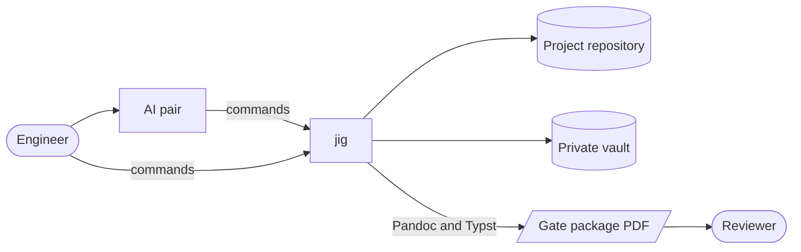

# Concept brief

## 1. Purpose and scope

This brief defines the problem JIG addresses, who it is for, what they need and what is out of scope. It is the baseline for the system requirements and for validation.

## 2. Problem statement

A solo engineer building hardware and software products benefits from the discipline of an industrial engineering process: defined phases, gate reviews, controlled documents, verifiable requirements and traceability. That process normally assumes a team, dedicated tools and hours of overhead per review. When an AI pair does most of the writing, consistency becomes the hard part: templates drift, conventions are forgotten between sessions, and private learning notes leak into public repositories.

## 3. Stakeholders

| Stakeholder | Role | Interest |
|---|---|---|
| Engineer | Runs projects on the bench | A repeatable process that costs minutes, not hours, per gate |
| AI pair | Writes most documents and code | Rules it can query and a check it can run |
| Reviewer | Engineering manager, partner or interviewer | Documents in a familiar industrial form, as PDF |

## 4. Stakeholder needs

| ID | Need | Stakeholder | Priority |
|---|---|---|---|
| N-01 | Start a project of any kind with the right structure and documents in one step | Engineer | Must |
| N-02 | Know at any time what the current phase requires and whether its gate is ready | Engineer | Must |
| N-03 | Keep private learning material out of project repositories, mechanically | Engineer | Must |
| N-04 | Hold requirements to industrial writing rules and trace them to verification | Engineer, reviewer | Must |
| N-05 | Send a reviewer one PDF per gate that reads like an industrial review package | Reviewer | Must |
| N-06 | Drive every operation from an AI session, without interactive prompts | AI pair | Must |
| N-07 | Rebuild the whole bench on a new machine | Engineer | Should |
| N-08 | Keep the AI pair's instructions and settings out of every project repository and its history, and get them back on any machine | Engineer | Must |

## 5. Operational concept

The engineer describes a project to the AI pair, which runs `jig new` with the chosen kind and tier. During each phase the pair drafts documents from jig's templates, the engineer reviews them, and `jig check` runs on every commit through a pre-commit hook. At the end of a phase, `jig gate open` produces the review record, the engineer confirms the entry criteria, `jig doc pack` produces the package for a reviewer, and `jig gate close` records the decision and opens the next phase.

## 6. Alternatives considered

| Alternative | Why it falls short |
|---|---|
| Requirements tools such as StrictDoc or sphinx-needs | Strong on requirements and traceability, but no lifecycle, gates or scaffolding, and their own source formats instead of GitHub-rendered Markdown |
| Document templates alone | Nothing enforces them, so conventions drift between sessions |
| Commercial PLM and ALM suites | Built and priced for teams, and not driven from a terminal |

## 7. Non-goals

- Team workflows: approvals by several people, access control and notifications.
- Model-based systems engineering with SysML.
- Hosting or publishing documents; jig produces files.

## 8. Targets

| Target | Value |
|---|---|
| Time to start a project | Under 1 minute |
| Time to check a 50-document project | Under 1 s |
| Time to render a 10-document gate package | Under 5 s |
| External programs | git, Pandoc and Typst only |

## 9. Revision history

| Rev | Date | Description | Author |
|---|---|---|---|
| A | 2026-09-30 | Initial baseline | dR4y54m5 |
